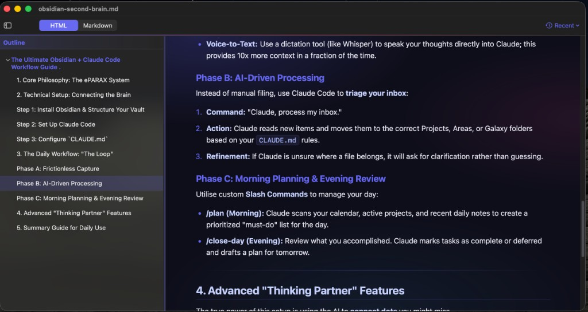
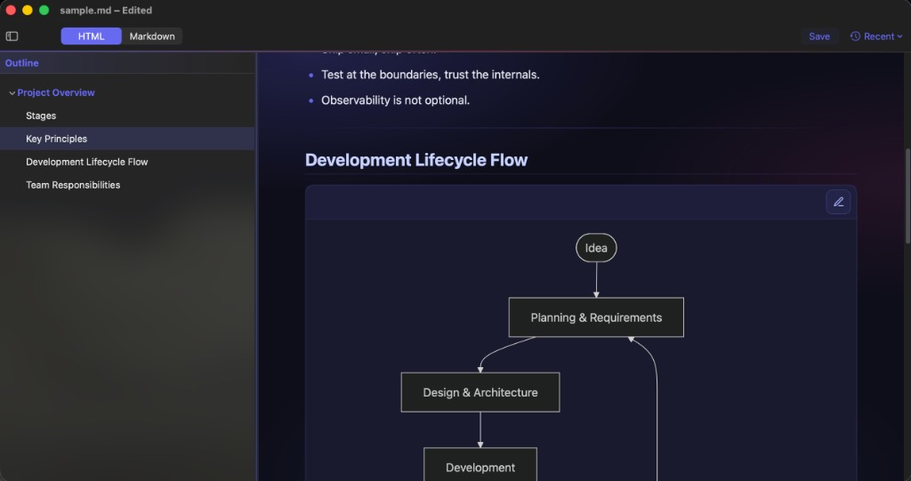
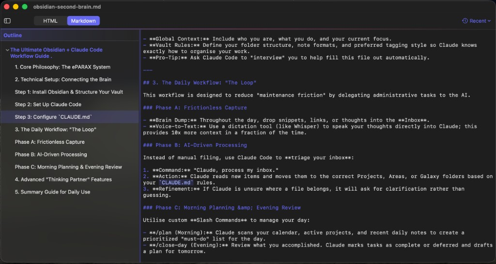

# Oh, HiMarkDown

A **lightweight native macOS** Markdown app for people who live in `.md` files: read your notes in a **clear, typographic layout** that feels like a real document—not a wall of hashes and fences—while still **editing naturally**, as if you were writing in a simple blog editor, without the weight of a full IDE. Switch to syntax-highlighted **Markdown** source whenever you want the raw text.

**Mermaid** diagrams in Markdown code fences tagged `mermaid` render as **live charts** in HTML mode (with source preview when you need to tweak the syntax). The look of the page is **highly customizable**: typography, colors, content width, and accents are yours to tune in **Settings → Style**, with presets for light, dark, and themed chrome.

**Created and maintained by [rg1989](https://github.com/rg1989).** Source code and releases: **[github.com/rg1989/HiMarkDown](https://github.com/rg1989/HiMarkDown)**.

> **macOS 13 Ventura or newer • Universal binary (Apple Silicon + Intel)**

## Screenshots

**HTML mode** — rendered document with the outline sidebar; the highlighted row follows the section at the top of the viewport.



**HTML mode — Mermaid** — the same view with a live diagram from a `mermaid` code fence; use the toolbar control to switch back to source when you want to edit the chart text.



**Markdown mode** — syntax-highlighted source editing with the same outline for quick jumps (including fenced `mermaid` blocks as plain text when you need the raw syntax).



---

## Why this project exists

If you work a lot with AI tooling, you live in Markdown: plans, agent skills, READMEs, handoff notes, and long context files are almost always `.md`. That is great for machines and diffs, but it creates a daily friction: **opening a full development environment** (Cursor, VS Code, or similar) just to *read* or lightly edit a single file feels heavy, and **raw Markdown in a plain text buffer** is not how humans prefer to skim structure. Headings, lists, and code blocks are all “there,” but they are not easy to scan or navigate the way a styled, readable page is.

HiMarkDown is a **small, focused native app** built for that workflow. It opens Markdown files like any other document app, renders them as **readable HTML** so structure and typography match how you actually consume the content, lets you **edit in that HTML view** when you want a WYSIWYG surface that does not get in your way, and keeps a **syntax-highlighted source mode** when you need the raw text. **Mermaid** blocks become diagrams you can actually *see*—important for architecture notes, flowcharts, and timelines—without pasting into another tool. A **heading outline** gives you a table-of-contents for the file: jump to sections quickly instead of scrolling through hashes and asterisks. You can **personalize** how the document looks (fonts, colors, width) so long reading sessions stay comfortable. The goal is comfort and speed for everyday Markdown—not a second IDE.

This repository is **open source** so anyone with the same itch can use it, improve it, or adapt it. If that sounds like your day job too, you are the audience.

---

## Install

**macOS 13 Ventura or newer.** Three install paths, easiest first:

### Option 1 — One-line install (recommended)

Paste in Terminal:

```bash
curl -fsSL https://raw.githubusercontent.com/rg1989/HiMarkDown/main/tools/install.sh | bash
```

What it does: downloads the latest release `.dmg`, verifies its SHA256, copies `HiMarkDown.app` to `/Applications`, and removes the macOS quarantine flag so the app launches without a Gatekeeper prompt. Read the script first if you'd rather audit before running — [`tools/install.sh`](tools/install.sh) is short.

Forks can override the repo with `HIMD_OWNER` / `HIMD_REPO` when piping the script.

To uninstall later:

```bash
curl -fsSL https://raw.githubusercontent.com/rg1989/HiMarkDown/main/tools/uninstall.sh | bash
```

### Option 2 — Homebrew (once a tap is published)

```bash
brew tap rg1989/himarkdown
brew install --cask himarkdown
```

Brew handles download, checksum verification, quarantine removal, install and uninstall (`brew uninstall --cask himarkdown`). The Cask file lives at [`tools/homebrew/himarkdown.rb`](tools/homebrew/himarkdown.rb) — see the *Releasing* section for how to publish it.

### Option 3 — Manual download

1. Grab the latest **`HiMarkDown-*.dmg`** from the [Releases page](../../releases/latest).
2. Open the `.dmg` and drag **HiMarkDown** into your **Applications** folder.
3. **First launch:** macOS will show *"HiMarkDown can't be opened because Apple cannot check it for malicious software."* — one-time and expected. Pick one:
   - **Easiest:** open **System Settings → Privacy & Security**, scroll down, click **Open Anyway** next to the HiMarkDown notice.
   - **Or in Finder:** right-click `HiMarkDown.app` → **Open** → **Open**.

> **Why the prompt?** The app is ad-hoc signed (no paid Apple Developer ID yet). The Gatekeeper warning is the only side-effect — Options 1 and 2 strip the quarantine flag for you so you skip it entirely.

### Option 4 — Build from source

Requires **Xcode 15+** (Command Line Tools alone are not enough).

```bash
git clone https://github.com/rg1989/HiMarkDown.git
cd HiMarkDown
open HiMarkDown.xcodeproj
# Press ⌘R in Xcode to build and run.
```

To produce a signed `.app.zip` + `.dmg` in `dist/` (the same way CI does):

```bash
./tools/release.sh
```

---

## Features

- **Two modes, one document.** Toggle between rich HTML rendering (TipTap) and the raw Markdown source. Scroll position and outline anchor are preserved across the switch.
- **Styled reading, natural editing** — HTML mode presents your file with real typography and spacing so structure is easy to see; you can edit inline without fighting raw syntax for everyday changes.
- **Mermaid diagrams** — fenced `mermaid` code blocks render as SVG previews in HTML mode, with a simple source / diagram toggle for editing the chart text.
- **Outline sidebar** — collapsible heading tree, click to jump (brief **brand-tinted glow** around the heading so you see where you landed). Resizable column with persisted width.
- **Themed UI** — Indigo brand chrome across the toolbar, sidebar and welcome hero. Adapts to light & dark macOS appearance.
- **Markdown syntax highlighting** in the source mode — headings, bold/italic, inline code, fenced code blocks, links, lists, blockquotes, and horizontal rules.
- **Custom HTML rendering** — every visual element (page background, body text, headings, links, code blocks, blockquote border, accent color, font stack, content width) is editable from **Settings → Style**, with light/dark/themed quick presets so you can personalize the reading experience.
- **Full undo/redo** that spans both modes (single document UndoManager).
- **Find & Replace** in both modes.
- **Markdown file association** — opens `.md`, `.markdown`, `.mdown` from Finder, double-click, and recent files.
- **App-Sandbox** with User-Selected File access — no network, no surprises.

---

## Build the web editor bundle

The TipTap bundle is committed under `HiMarkDown/Web/editor.js`, so a fresh checkout builds without Node. To rebuild after changing `WebEditor/`:

```bash
cd WebEditor
npm install
npm run build
```

---

## Releasing (maintainers)

This project uses **GitHub Actions** (`.github/workflows/release.yml`). To cut a release:

```bash
# 1. Bump the version in HiMarkDown/Info.plist (CFBundleShortVersionString).
# 2. Commit, push.
git commit -am "Bump version to 1.2.0"
git push

# 3. Tag and push the tag — CI takes over from here.
git tag v1.2.0
git push origin v1.2.0
```

The workflow builds, ad-hoc signs, packages a `.dmg` + `.app.zip` + a `SHA256` manifest, and creates a GitHub Release with auto-generated notes plus a ready-to-paste Homebrew Cask snippet.

### Publishing the Homebrew tap (one-time setup)

1. Create a public repo on your GitHub account named exactly `homebrew-himarkdown` (the `homebrew-` prefix is required by `brew tap`).
2. Add a `Casks/` folder and copy [`tools/homebrew/himarkdown.rb`](tools/homebrew/himarkdown.rb) into it as `Casks/himarkdown.rb`. The template already points at [`rg1989/HiMarkDown`](https://github.com/rg1989/HiMarkDown); set `version` and `sha256` from the GitHub Release manifest when you publish each version.
3. Cut your first release in this repo (above). The release notes will contain a copy-paste snippet with the new version + correct SHA256 — paste it into `Casks/himarkdown.rb` in the tap repo and commit.
4. Users can now install with `brew tap rg1989/himarkdown && brew install --cask himarkdown`.

For each subsequent release, copy the snippet from the GitHub Release notes into `Casks/himarkdown.rb` and commit. (You can automate this further with a separate workflow that opens a PR against the tap repo — happy to add that later if it becomes annoying.)

### Optional: enable signing + notarization

When you get an Apple Developer Program membership ($99/yr), add four repository secrets and the same workflow will Developer-ID-sign and notarize the artifacts (zero code changes):

| Secret | What |
|---|---|
| `DEVELOPER_ID_APPLICATION_CERT` | Base64 of your exported `Developer ID Application` `.p12` |
| `DEVELOPER_ID_CERT_PASSWORD` | The password you set when exporting the `.p12` |
| `APPLE_ID` | Your Apple ID email |
| `APPLE_APP_SPECIFIC_PASSWORD` | App-specific password from [appleid.apple.com](https://appleid.apple.com/account/manage) |
| `APPLE_TEAM_ID` | 10-character team ID from `developer.apple.com/account` |

`tools/release.sh` and the workflow auto-detect these — if absent, they fall back to ad-hoc signing.

---

## Project layout

```
HiMarkDown/                Native SwiftUI app target
  HiMarkDownApp.swift        @main, menus, app-delegate
  ContentView.swift          Toolbar + outline + editor stack
  MarkdownEditorView.swift   NSTextView wrapper (Markdown source)
  MarkdownHighlighter.swift  Regex-based syntax coloring
  WebEditorView.swift        WKWebView wrapper (HTML mode, TipTap)
  OutlineSidebar.swift       Collapsible heading list
  HiAppearance.swift         Shared brand colors & chrome utilities
  SettingsAndFind.swift      Settings window + Find/Replace sheet
  Web/                       Static assets loaded into WKWebView
WebEditor/                  TypeScript source → builds Web/editor.js
tools/
  release.sh                 Local build + sign + package
  generate_pbxproj.py        Regenerate project.pbxproj from a flat file list
.github/workflows/
  release.yml                Tagged-release CI (build + GitHub Release)
```

---

## Contributing

Issues and pull requests welcome. Before opening a PR:

- Run the app locally and confirm the change works in both **HTML** and **Markdown** modes.
- If you touch `WebEditor/` source, rebuild `HiMarkDown/Web/editor.js` and commit it (the production bundle is checked in so the app builds without Node).
- New Swift files go in `tools/generate_pbxproj.py` — re-run `python3 tools/generate_pbxproj.py` to update the Xcode project.

---

## License

[MIT](LICENSE) — © 2026 rg1989 and HiMarkDown contributors.
